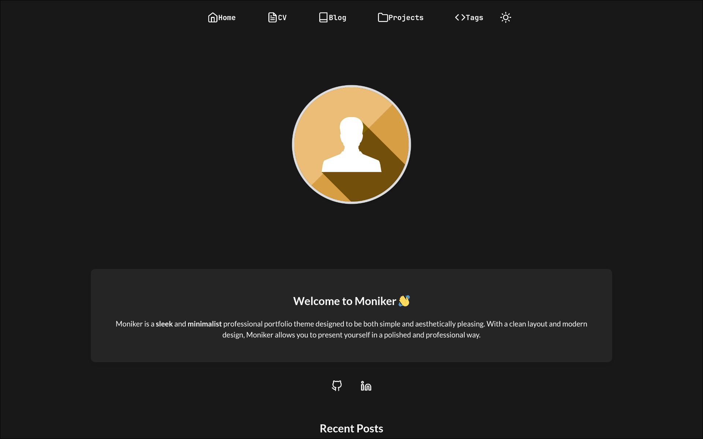

# Moniker

Moniker is a **sleek** and **minimalist** professional portfolio theme designed to be both simple and aesthetically pleasing. With a clean layout and modern design, Moniker allows you to present yourself in a polished and professional way.

I made this theme as a **personal challenge** as I am not a front-end web developer and wanted to experiment with creating my own theme. I may update this theme in the future and add more parameters and detailed documentation, at which point I may consider submitting it to the official Hugo themes repository. 

